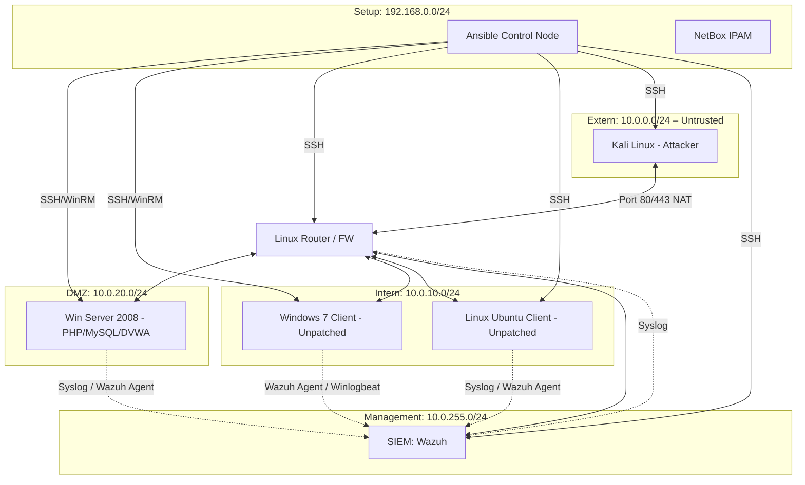

# Security Lab – Deliverables Session 2

---

## 1. Aktualisierter Netzwerkplan

### Topologie-Übersicht



> **Hinweis (Phase 1):** In dieser Phase ist kein Firewall-Regelwerk aktiv. Der Linux-Router agiert als reiner Layer-3-Router und lässt sämtlichen Traffic durch. Die Firewall-Konfiguration (Sophos) folgt in einer späteren Phase.

---

### Hosts & installierte Services

| Host | IP-Bereich | OS | Rolle | Installierte Services |
|---|---|---|---|---|
| **Kali Linux** | 10.0.0.x | Kali Linux (Rolling) | Angreifer | Nmap, Nuclei, OpenVAS, Metasploit, Burp Suite, SSH |
| **Linux Router** | Multi-homed | Debian/Ubuntu | Router (kein Firewall-Regelwerk in Phase 1) | iptables (nur Forwarding), SSH, Syslog-Forwarding |
| **Win Server 2008** | 10.0.20.x | Windows Server 2008 R2 | Webserver / DMZ-Target | IIS / Apache, PHP, MySQL, DVWA (Damn Vulnerable Web App), SMB (Filesharing), RDP |
| **Windows 7 Client** | 10.0.10.x | Windows 7 (ungepatcht) | LAN-Client / Target | SMB (Filesharing), RDP, Printserver (Windows Druckdienst), SSH (optional via Cygwin/OpenSSH), Wazuh Agent |
| **Ubuntu Desktop** | 10.0.10.x | Ubuntu Desktop (ungepatcht) | LAN-Client / Target | SSH, Samba (Filesharing), VNC (Screensharing), CUPS (Printserver), Wazuh Agent |
| **Wazuh SIEM** | 10.0.255.x | Ubuntu Server | SIEM / XDR | Wazuh Manager, Wazuh Dashboard (Kibana-basiert), Elasticsearch |
| **Ansible Control Node** | 192.168.0.x | Ubuntu Server | Provisioning | Ansible, SSH |
| **NetBox** | 192.168.0.x | Ubuntu Server | IPAM | NetBox, PostgreSQL, Redis |

---

### Netzwerksegmente

| Segment | Subnetz | Zweck |
|---|---|---|
| Extern / Untrusted | 10.0.0.0/24 | Angreifer (Kali) – simuliert Internet |
| DMZ | 10.0.20.0/24 | Öffentlich erreichbare Dienste (Webserver) |
| Intern / LAN | 10.0.10.0/24 | Interne Clients (Win7, Ubuntu) |
| Management | 10.0.255.0/24 | SIEM / Monitoring – nur intern erreichbar |
| Setup / Provisioning | 192.168.0.0/24 | Ansible, NetBox – Out-of-Band-Management |

---

## 2. Evaluierungsplan – Vulnerability Assessment

### Ziel
Erfassung aller relevanten Schwachstellen im Netzwerk auf mehreren Ebenen: OS-Level, Dienste-Level und Web-Applikation.

---

### Scanning-Architektur (Multi-Layer)

#### Schicht 1 – Reconnaissance & Port Scanning
**Tool: Nmap**
- Ziel: Dienste- und Port-Erkennung, OS-Fingerprinting, Service-Versionserkennung
- Einsatz: Initial auf alle Segmente (DMZ, LAN)

#### Schicht 2 – OS- & Netzwerk-Level Vulnerability Scanning
**Tool: OpenVAS (Greenbone Community Edition)**
[https://www.openvas.org/](https://www.openvas.org/)
- Ziel: Umfassende Schwachstellenanalyse auf OS- und Dienste-Ebene (CVE-basiert)
- Einsatz: Deep-Scan gegen Win Server 2008, Windows 7, Ubuntu Desktop
- Liefert: CVSS-bewertete Findings, Patch-Empfehlungen, Compliance-Reports
- Besonderheit: Ersatz für Nessus – vollständig Open Source, vergleichbarer Funktionsumfang

#### Schicht 3 – Service & Web Application Scanning
**Tool: Nuclei (ProjectDiscovery)**
[https://projectdiscovery.io/nuclei](https://projectdiscovery.io/nuclei)
- Ziel: Template-basiertes Scannen auf spezifische CVEs, Web-Misconfigurations, Default-Credentials, Exposed Panels
- Einsatz:
  - Gegen den Webserver (DVWA): SQLi-Templates, XSS-Templates, PHP-spezifische CVEs
  - Gegen alle Hosts: Dienste-spezifische Templates (SMB, RDP, SSH)
- Vorteil gegenüber reinem Banner-Scanning: Nuclei verifiziert Schwachstellen aktiv anhand von Templates, nicht nur anhand von Versionsnummern

#### Schicht 4 – Web Application Testing (Manuell & automatisiert)
**Tool: Burp Suite Community**
- Ziel: Manuelle Verifikation und gezielte Tests auf DVWA (SQLi, XSS, CSRF, Command Injection)
- Einsatz: Ergänzend zu Nuclei für tiefere Analyse der Web-App

---

### Scanning-Workflow

```
Nmap (Recon)
   └─► OpenVAS (OS/Dienste Deep-Scan)
   └─► Nuclei (CVE / Web-App Template-Scan)
         └─► Burp Suite (manuelle Web-App Verifikation)
               └─► Alle Findings → Wazuh SIEM (Aggregation & Alerting)
```

---

### Abdeckungsmatrix

| Target | Nmap | OpenVAS | Nuclei | Burp Suite |
|---|---|---|---|---|
| Win Server 2008 (DVWA) | ✓ | ✓ | ✓ | ✓ |
| Windows 7 (ungepatcht) | ✓ | ✓ | ✓ | – |
| Ubuntu Desktop | ✓ | ✓ | ✓ | – |
| Linux Router | ✓ | – | ✓ | – |

---

## 3. Ergebnisse / Lehren aus dem Setup

*(Wird nach dem ersten Scan-Durchlauf befüllt.)*

### Erkenntnisse aus der Einrichtung
- **NAT-Problem:** Kali muss direkt im selben L3-Segment hängen bzw. der Router darf kein Masquerading/Source-NAT durchführen, damit Rückpfade stimmen und Tools wie Metasploit korrekt funktionieren.
- **WinRM-Aktivierung auf Win7:** Erforderte manuelle Aktivierung via `winrm quickconfig` – Ansible-Provisioning war erst danach möglich.
- **DVWA-Konfiguration:** MySQL-Root-Passwort und `config.inc.php` mussten manuell angepasst werden.

### Ergebnisse der ersten Scans

*(Werden nach Durchführung ergänzt.)*

| Tool | Target | Kritische Findings | Beispiel-CVEs |
|---|---|---|---|
| Nmap | – | – | – |
| OpenVAS | – | – | – |
| Nuclei | – | – | – |

---

## 4. Hinweise für Phase 1

- **Kein Firewall-Regelwerk aktiv** – Router leitet allen Traffic weiter (kein iptables-DROP)
- Angreifer (Kali) ist so positioniert, dass kein Source-NAT den Scan-Traffic verfälscht
- Alle Clients haben bewusst zusätzliche Dienste installiert (Filesharing, Printserver, Screensharing, SSH), um eine realistische Angriffsfläche zu simulieren
- Firewall-Integration (Sophos + WAF) folgt in einer späteren Phase (sophos ist aufgesetzt aber nicht aktiv aktuell)
